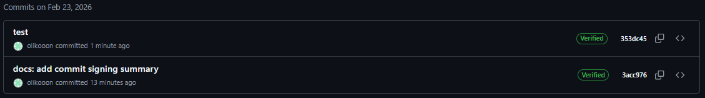
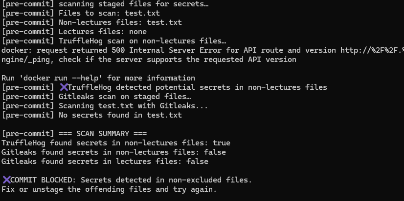

## Task 1 — SSH Commit Signature Verification

### Summary: Benefits of Signing Commits for Security

Commit signing ensures that every commit in a repository can be verified as coming from a trusted author and that its contents have not been altered. By using SSH commit signing, developers create cryptographic proof of authorship and integrity. This helps prevent impersonation, unauthorized code injection, and supply chain attacks. Signed commits increase trust in collaboration, especially in distributed teams and open-source projects.

### Evidence of Successful SSH Key Setup and Configuration

An SSH key was generated using the Ed25519 algorithm and added to the Git hosting platform. Git was configured to use SSH signing by setting the signing key, enabling automatic signing for commits, and specifying the SSH format. A signed commit was created using the -S flag, and the repository platform displayed the commit as verified, confirming correct configuration.

Configuration steps included:

* Generating an SSH key pair
* Adding the public key to the Git hosting account
* Configuring Git (user.signingkey, commit.gpgSign, gpg.format)
* Creating and pushing a signed commit

### Analysis: Why Commit Signing Is Critical in DevSecOps Workflows

Commit signing is essential in DevSecOps because it establishes trust across the software delivery pipeline. It ensures that code changes originate from authenticated developers and have not been tampered with. This reduces the risk of malicious code entering the codebase, supports auditability, and strengthens supply chain security. Signed commits also enable automated policy enforcement in CI/CD pipelines, where only verified changes may be merged or deployed.

## Task 2 — Pre-commit Secret Scanning

### Pre-commit Hook Setup Process and Configuration

A local Git pre-commit hook was implemented to automatically scan staged files for potential secrets before allowing a commit. The hook was created at .git/hooks/pre-commit and made executable. It collects staged files, separates lecture materials from other files, and runs two security tools inside Docker containers:

* TruffleHog scans non-lecture files using entropy and pattern-based detection to identify sensitive data such as API keys, tokens, and credentials.
* Gitleaks scans each staged file for known secret patterns and produces detailed findings.

The hook blocks commits if secrets are detected in non-excluded files while allowing educational examples located in the lectures directory.

### Evidence of Successful Secret Detection Blocking Commits

To validate the hook, a test file containing a fake AWS secret key was created and staged. When attempting to commit, the pre-commit hook executed automatically, ran both scanners, and detected the secret. The commit was blocked with an error message indicating that sensitive information had been found.

### Test Results Showing Both Blocked and Successful Commits

Two test scenarios were performed:

1. Blocked commit:
   A file containing a fake credential triggered the scanners and prevented the commit, confirming that the security control works as intended.

2. Successful commit:
   After removing or redacting the secret, the files were staged again and committed successfully. The hook completed the scans and reported no detected secrets, allowing the commit to proceed.

### Analysis: How Automated Secret Scanning Prevents Security Incidents

Automated secret scanning acts as an early security control in the development lifecycle (shift-left security). By detecting credentials before code is committed, it prevents accidental exposure of sensitive information in version control systems. This reduces the risk of account compromise, data breaches, and supply chain attacks.

Integrating secret scanning into pre-commit workflows enforces consistent security practices without relying on manual review. It improves developer awareness, shortens remediation time, and minimizes the blast radius of potential leaks. Combined with CI/CD checks, automated scanning creates layered protection that strengthens overall DevSecOps security posture.

